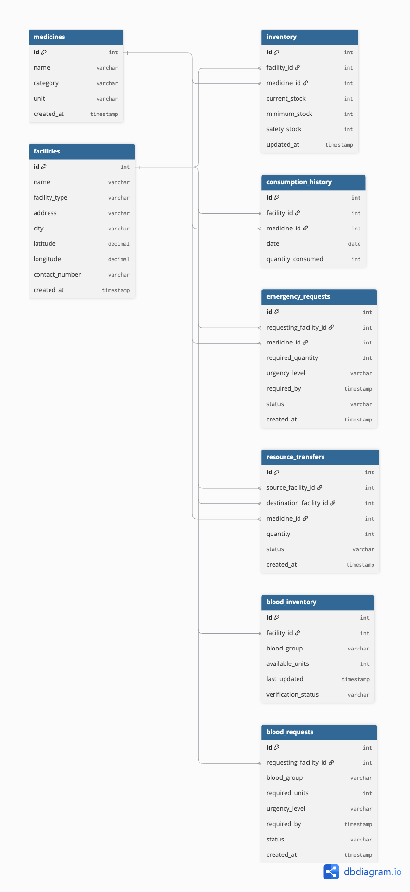

# Entity Relationship Diagram

This diagram defines the initial database structure for the Healthcare Resource Intelligence & Emergency Coordination Platform.

## Database Entities

The system currently contains the following core entities:

- Facilities
- Medicines
- Inventory
- Consumption History
- Emergency Requests
- Resource Transfers
- Blood Inventory
- Blood Requests

## Relationships

- A facility can have multiple inventory records.
- A medicine can exist in multiple facility inventories.
- A facility can have multiple consumption history records.
- A facility can create multiple emergency requests.
- A medicine can be requested through multiple emergency requests.
- A facility can act as both source and destination in resource transfers.
- A facility can maintain blood inventory.
- A facility can create multiple blood requests.

## Diagram

## Data Source

The database will initially operate using synthetic/demo data for the internal hackathon prototype.